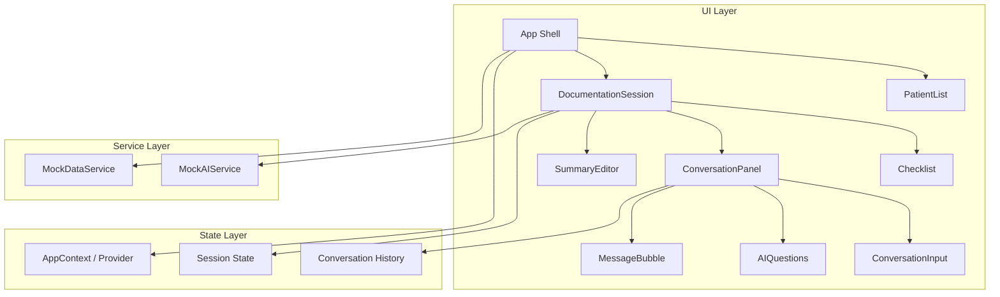
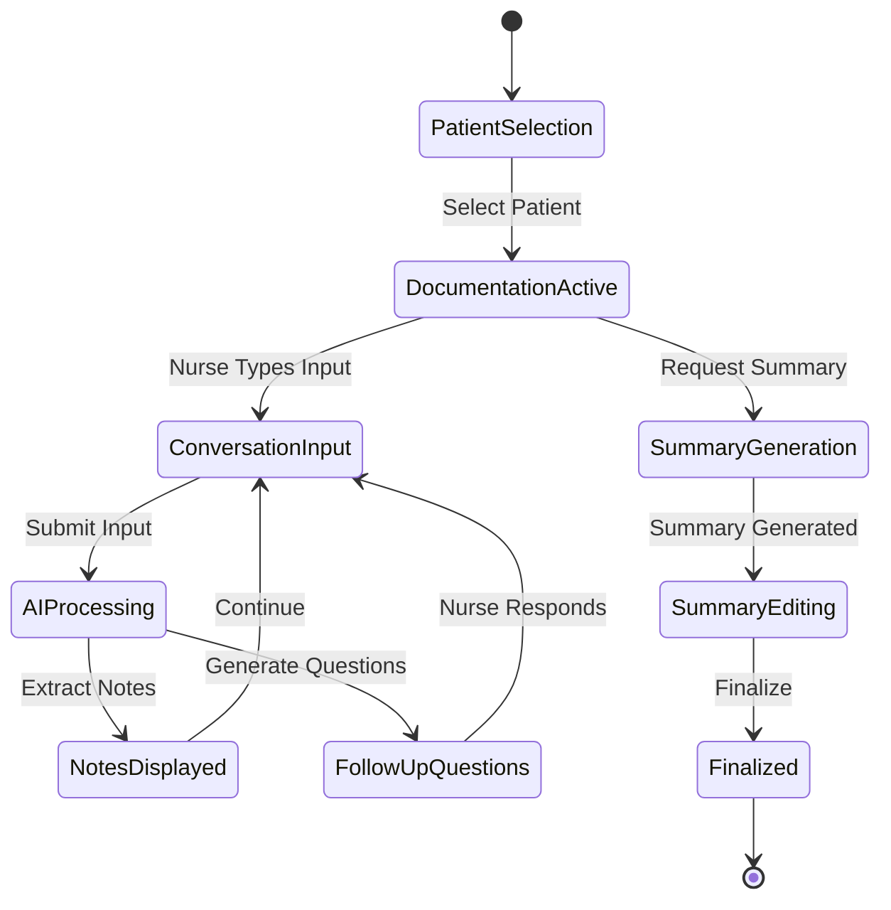

# Design Document: Nursing Notes App

## Overview

An iPad-optimized single-page React application that helps nurses document patient care through a simulated AI-assisted conversational interface. The app is built with React + Vite, styled with Tailwind CSS and shadcn/ui, and uses the Corporate Trust design system (indigo/violet palette, Plus Jakarta Sans, elevated cards). All AI behavior is mocked with simulated delays, and data is stored entirely in-memory using React state and context.

The architecture prioritizes a clean separation between UI components, state management, and the mock AI service layer. This separation supports future replacement of mocked AI with real API integrations and addition of authentication/persistence without major refactoring.

## Architecture



### Application Flow



### Key Architectural Decisions

| Decision | Choice | Rationale |
|----------|--------|-----------|
| State management | React Context + useReducer | Sufficient for in-memory single-session state; avoids external dependencies |
| AI service abstraction | Interface-based module with Promise returns | Allows future swap to real API without UI changes |
| Styling approach | Tailwind CSS + shadcn/ui | Matches Corporate Trust design system; consistent component library |
| Page structure | Single scrollable page with section refs | Meets iPad UX requirements; avoids complex routing |
| Data storage | In-memory mock data | No persistence needed; simplifies demo setup |

## Components and Interfaces

### Component Hierarchy

```
App
├── AppProvider (context)
├── Header (branding, session info)
├── PatientList (patient selection view)
└── DocumentationSession (main documentation view)
    ├── SessionHeader (patient info, progress)
    ├── Checklist (patient-specific items)
    ├── ConversationPanel
    │   ├── MessageBubble (nurse input / AI response)
    │   ├── AIQuestions (follow-up questions)
    │   └── ConversationInput (text input area)
    └── SummaryEditor (generated summary with inline editing)
```

### Component Interfaces

```typescript
// PatientList
interface PatientListProps {
  patients: Patient[];
  onSelectPatient: (patientId: string) => void;
}

// Checklist
interface ChecklistProps {
  items: ChecklistItem[];
  onToggleItem: (itemId: string) => void;
  completedCount: number;
  totalCount: number;
}

// ConversationPanel
interface ConversationPanelProps {
  messages: ConversationMessage[];
  onSubmitInput: (text: string) => void;
  isProcessing: boolean;
}

// ConversationInput
interface ConversationInputProps {
  onSubmit: (text: string) => void;
  disabled: boolean;
  placeholder: string;
}

// AIQuestions
interface AIQuestionsProps {
  questions: FollowUpQuestion[];
  onRespond: (questionId: string, response: string) => void;
}

// SummaryEditor
interface SummaryEditorProps {
  sections: SummarySection[];
  onEditSection: (sectionId: string, newContent: string) => void;
  onFinalize: () => void;
  isEditing: boolean;
}

// MessageBubble
interface MessageBubbleProps {
  message: ConversationMessage;
  variant: 'nurse' | 'ai';
}
```

### Mock AI Service Interface

```typescript
interface MockAIService {
  processInput(
    input: string,
    patient: Patient,
    checklist: ChecklistItem[],
    sessionContext: ConversationMessage[]
  ): Promise<AIProcessingResult>;

  generateFollowUpQuestions(
    patient: Patient,
    uncheckedItems: ChecklistItem[],
    sessionContext: ConversationMessage[]
  ): Promise<FollowUpQuestion[]>;

  generateSummary(
    patient: Patient,
    checklist: ChecklistItem[],
    notes: StructuredNote[],
    sessionContext: ConversationMessage[]
  ): Promise<ShiftSummary>;
}

interface AIProcessingResult {
  structuredNotes: StructuredNote[];
  checkedItemIds: string[];
  followUpQuestions: FollowUpQuestion[];
}
```

## Data Models

```typescript
// Patient
interface Patient {
  id: string;
  name: string;
  room: string;
  age: number;
  conditions: string[];
  allergies: string[];
}

// ChecklistItem
interface ChecklistItem {
  id: string;
  patientId: string;
  category: string;
  label: string;
  description: string;
  isChecked: boolean;
  checkedAt?: number; // timestamp
  notes?: string;
}

// ConversationMessage
interface ConversationMessage {
  id: string;
  type: 'nurse-input' | 'ai-response' | 'follow-up-question' | 'nurse-response';
  content: string;
  timestamp: number;
  relatedChecklistItems?: string[]; // item IDs
}

// StructuredNote
interface StructuredNote {
  id: string;
  checklistItemId?: string;
  category: string;
  content: string;
  extractedFrom: string; // original nurse input
  timestamp: number;
}

// FollowUpQuestion
interface FollowUpQuestion {
  id: string;
  question: string;
  relatedChecklistItemId?: string;
  answered: boolean;
  response?: string;
}

// ShiftSummary
interface ShiftSummary {
  id: string;
  patientId: string;
  generatedAt: number;
  sections: SummarySection[];
  finalized: boolean;
}

// SummarySection
interface SummarySection {
  id: string;
  title: string;
  content: string;
  isEditing: boolean;
}

// Session State
interface DocumentationSessionState {
  patient: Patient | null;
  checklist: ChecklistItem[];
  messages: ConversationMessage[];
  structuredNotes: StructuredNote[];
  summary: ShiftSummary | null;
  isProcessing: boolean;
  phase: 'patient-selection' | 'documentation' | 'summary';
}
```

### Mock Data Structure

```typescript
// Mock patient data organized per-patient with condition-specific checklists
const mockPatients: Patient[] = [
  {
    id: 'p1',
    name: 'Margaret Thompson',
    room: '204A',
    age: 78,
    conditions: ['Type 2 Diabetes', 'Hypertension'],
    allergies: ['Penicillin']
  },
  {
    id: 'p2',
    name: 'Robert Chen',
    room: '112B',
    age: 85,
    conditions: ['Heart Failure', 'COPD'],
    allergies: ['Sulfa drugs']
  },
  // ...more patients
];

// Checklists keyed by patient condition
const checklistTemplates: Record<string, ChecklistItem[]> = {
  'Type 2 Diabetes': [
    { id: 'diabetes-1', label: 'Blood glucose level', category: 'Vitals', ... },
    { id: 'diabetes-2', label: 'Insulin administered', category: 'Medications', ... },
    // ...
  ],
  'Hypertension': [
    { id: 'hyper-1', label: 'Blood pressure reading', category: 'Vitals', ... },
    // ...
  ],
  // ...more condition templates
};
```

## Correctness Properties

*A property is a characteristic or behavior that should hold true across all valid executions of a system — essentially, a formal statement about what the system should do. Properties serve as the bridge between human-readable specifications and machine-verifiable correctness guarantees.*

### Property 1: Checklist construction by patient conditions

*For any* patient with a set of conditions, starting a documentation session SHALL produce a checklist containing exactly the items associated with those conditions, and patients with different conditions SHALL receive different checklist items.

**Validates: Requirements 1.3, 2.1, 2.2**

### Property 2: Checklist toggle idempotence

*For any* checklist item in any state (checked or unchecked), toggling it twice SHALL return the item to its original state.

**Validates: Requirements 2.4**

### Property 3: Checklist order independence (confluence)

*For any* set of checklist items and any two permutations of checking those items, the final checked/unchecked state of all items SHALL be identical regardless of the order in which items were toggled.

**Validates: Requirements 2.5**

### Property 4: Progress computation accuracy

*For any* checklist with N total items where K items are checked, the displayed progress SHALL equal K/N (as a ratio or percentage).

**Validates: Requirements 2.6**

### Property 5: Input processing produces valid structured notes

*For any* non-empty nurse input string (whether initial input or follow-up response), processing by the AI service SHALL produce structured notes where each note has a valid id, non-empty content, a category, and a timestamp.

**Validates: Requirements 3.2, 4.4**

### Property 6: Auto-checked items are a valid subset

*For any* AI processing result that auto-checks checklist items, the set of auto-checked item IDs SHALL be a subset of the patient's existing checklist item IDs, and SHALL only include items that were unchecked prior to processing.

**Validates: Requirements 3.4, 4.3**

### Property 7: Follow-up questions reference valid patient data

*For any* patient and session context, all generated follow-up questions SHALL reference only conditions or checklist items belonging to that specific patient (no cross-patient data leakage).

**Validates: Requirements 4.1, 9.3**

### Property 8: Summary completeness

*For any* documentation session with a set of structured notes and checked checklist items, the generated shift summary SHALL contain content derived from every structured note and every checked checklist item.

**Validates: Requirements 5.1, 5.3, 9.4**

### Property 9: Summary structural validity

*For any* generated shift summary, the sections array SHALL be non-empty and every section SHALL have a non-empty title and non-empty content.

**Validates: Requirements 5.2**

### Property 10: Summary section edit round-trip

*For any* summary section and any new content string, editing that section's content and immediately reading it back SHALL yield the exact new content string (no data loss or transformation).

**Validates: Requirements 6.3**

### Property 11: AI response delay bounds

*For any* call to any AI service method (processInput, generateFollowUpQuestions, generateSummary), the simulated delay SHALL be between 500ms and 2000ms inclusive.

**Validates: Requirements 9.2**

## Error Handling

Since this is a fully mocked, in-memory application with no external API calls or persistence, error handling focuses on UI state consistency and user feedback:

### Input Validation
- Empty text submissions are silently ignored (submit button disabled when input is empty)
- Extremely long inputs are truncated with a character limit indicator

### State Consistency
- If the session state becomes invalid (e.g., referencing a non-existent checklist item), the app gracefully ignores the invalid reference rather than crashing
- Summary generation requires at least one documented observation; the generate button is disabled otherwise

### Mock AI Processing
- The mock AI service always returns valid data (no simulated failures) since the goal is demonstrating the workflow
- Processing state indicators (loading spinners, disabled inputs) prevent duplicate submissions during simulated delays

### Accessibility Error States
- Form validation errors communicate through both visual indicators (red border, error text) and ARIA live regions
- Focus management returns to the relevant input after an error is corrected

## Testing Strategy

### Unit Tests
- Component rendering tests using React Testing Library
- Mock AI service logic tests (input processing, checklist matching, summary generation)
- State reducer tests for session state transitions
- Data model validation tests

### Property-Based Tests
- **Library**: fast-check (JavaScript property-based testing library)
- **Configuration**: Minimum 100 iterations per property test
- Properties validate core business logic: checklist state management, input processing, summary generation integrity

### Integration Tests
- Full documentation flow: patient selection → input → follow-up → summary → edit → finalize
- Accessibility audit using axe-core
- Touch target size verification

### What Is NOT Property Tested
- UI rendering and layout (use snapshot tests instead)
- Simulated delay timing (use example-based tests)
- ARIA labeling (use axe-core accessibility audit)
